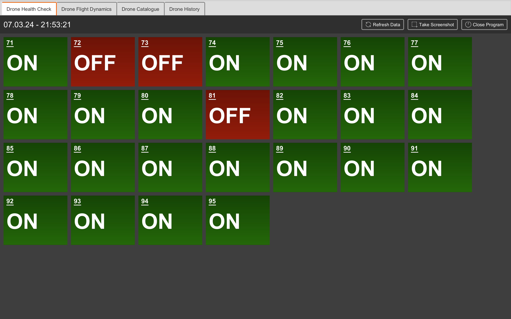
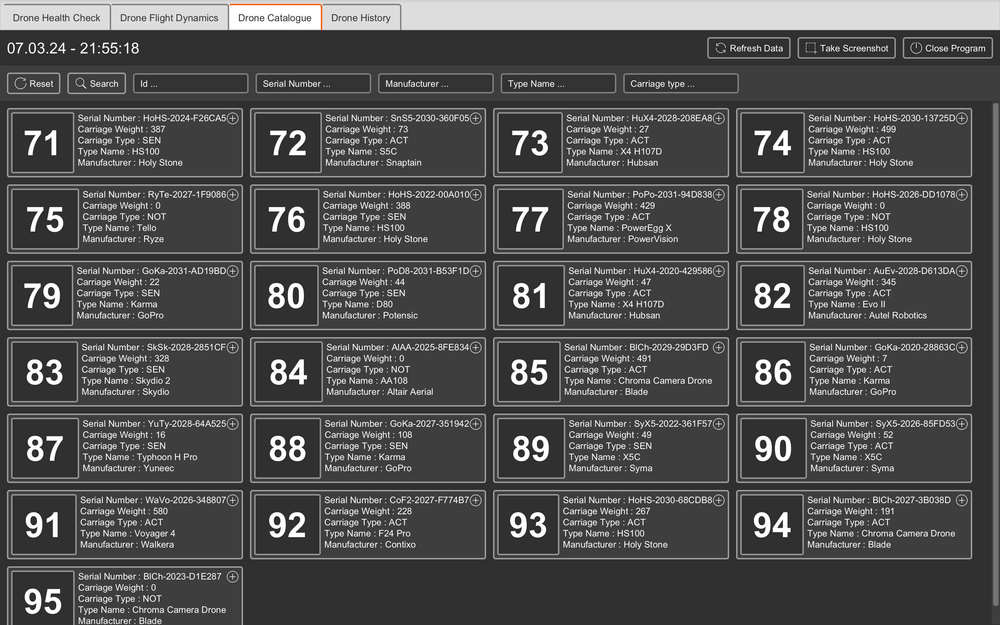
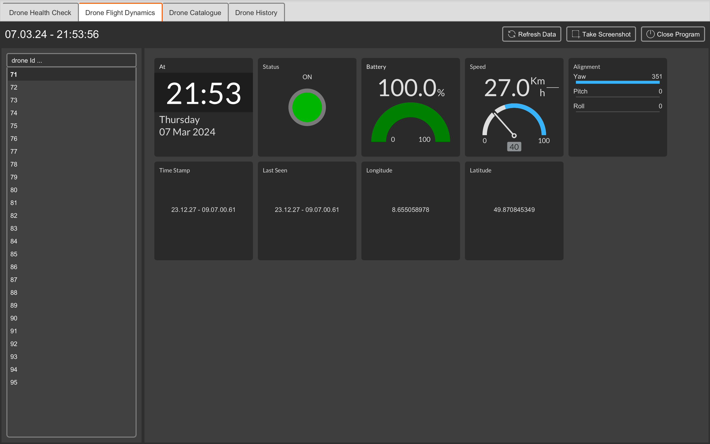
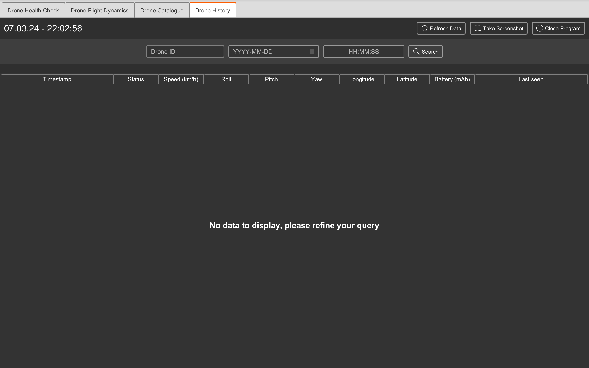

> ## :man_technologist: :woman_technologist: Contributor / Students 
<sup>ORDER BY LAST_NAME ASC</sup><br>
Asghar Yassine<br>Bromkamp Noel<br>Froussos Flynn<br>Islam Muntaha<br>Islam Safana

> ## :strawberry: App Screenshots : 






> ## :strawberry: Program Start Guide

> ### :strawberry: Alternative 1: Double-Click Start

To start the program using this method, simply double-click on the `.jar` file of the program.

Upon double-clicking:
1. The program will read the default configuration stored inside the `.jar` file.
2. The program will also create a `logs` folder in the same directory where the `.jar` file is located. For instance, `$PWD/logs/0.log`.

> ### :strawberry: Alternative 2: Command Line Start

Starting your program from the command line provides access to hidden features. The order of arguments is not important.

1. **Use a Custom Configuration File:**

   This feature allows you to use a desired configuration file with the same structure as the one inside the `.jar` file. Values can be changed depending on the droneSimulator environment.

   - **Config file structure:**
     ```yaml
     client:
       user: 'encoded in base64'
       password: 'encoded in base64'
       token: 'encoded in base64'
       domain: 'environment URL'
       agent: 'agent string'
       endpoints:
         drones: '/api/drones'
         types: '/api/dronetypes'
         dynamics: '/api/dronedynamics'
     ```
   - **Config file extension:** `.yaml`

   To use a custom configuration file, enter the following command in your terminal:
   ```bash
   java -jar filename.jar --config path/to/your/config/file.yaml
   ```
 
2. **Use a Custom Configuration File:**
   
   This feature allows you to decide where your log files should be stored.
To use a custom log file, enter the following command in your terminal:
   ```bash
   java -jar filename.jar --log path/to/your/log/file.log 
   ```

3. **Use Both Custom Configuration and Log Files:**
   
   You can also specify both custom configuration and log file locations in one run.
To do this, enter the following command in your terminal:
   ```bash
   java -jar filename.jar --config path/to/your/config/file.yaml --log  path/to/your/log/file.log
   ```
> [!TIP]
   > You can switch the order of the arguments:
   ```bash
   java -jar filename.jar --log path/to/your/log/file.log --config path/to/your/config/file.yaml
   ```
> [!IMPORTANT]
   > ***Remember*** to replace `filename.jar`, `path/to/your/config/file.yaml`, and `path/to/your/log/file.log` with your actual file names and paths. 
No matter in what order your arguments go, the outcome remains the same.

> [!IMPORTANT]
   > ***This program will start if the config file contains valid data (token, ...) and the device is connected to the university network.***

> [!CAUTION]
> You can locate all external libraries utilized in this project either through Maven installation or by downloading the JAR files online.
> Please note that these libraries have their creative commons and rules/policies, so it's advisable to read their documentation.
